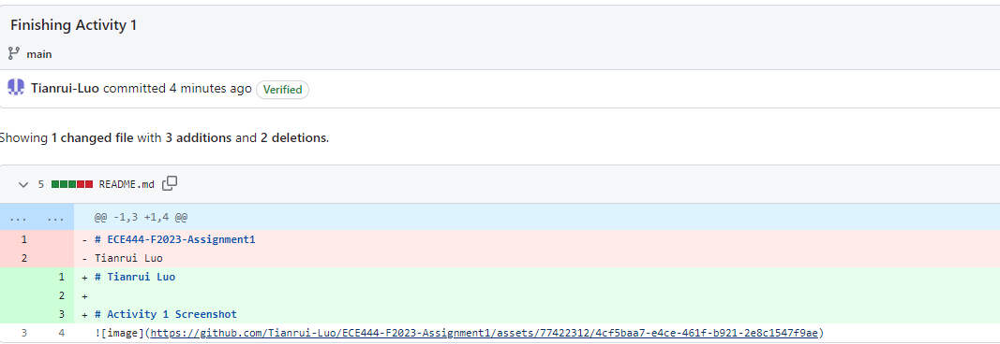
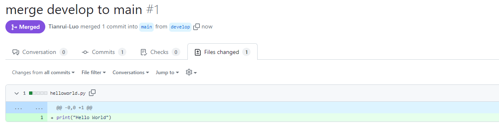
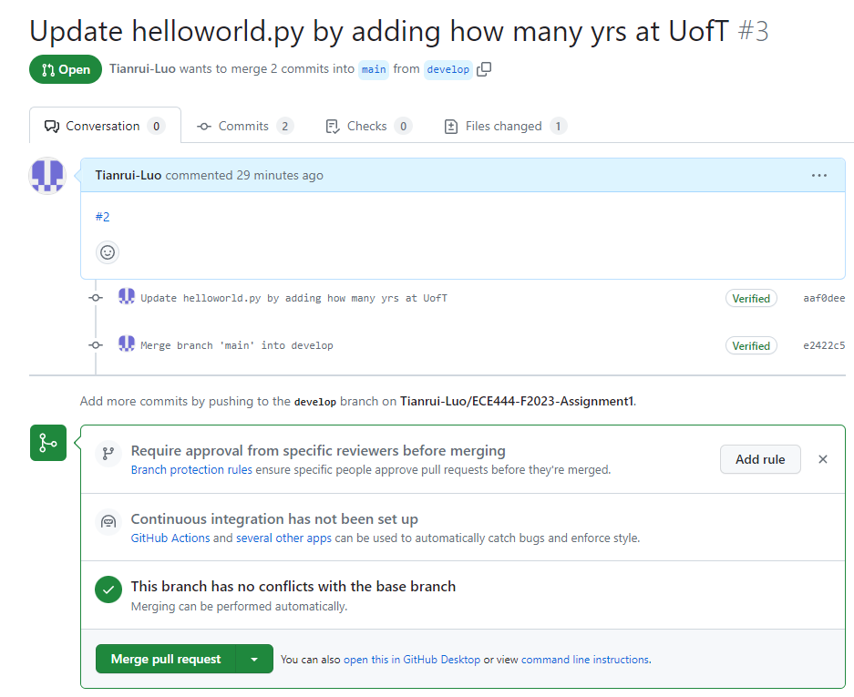
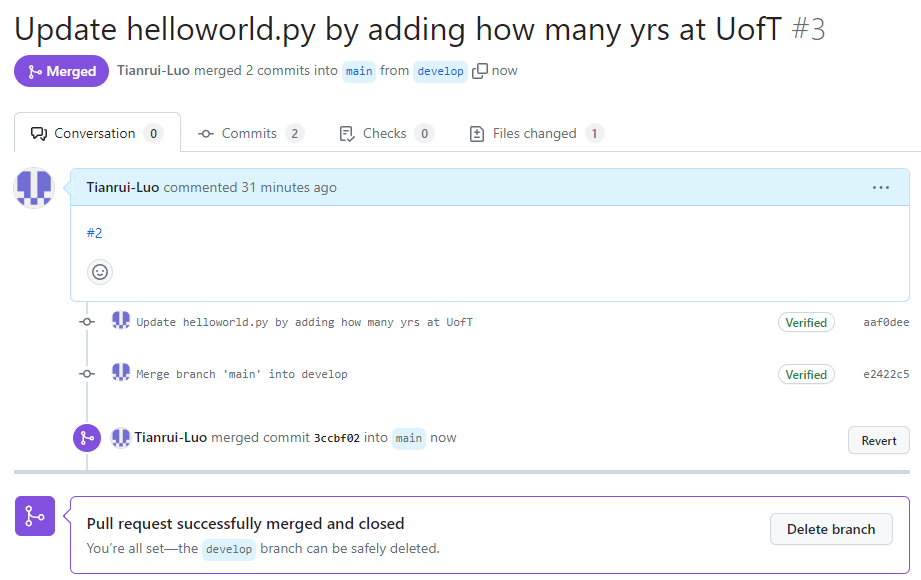
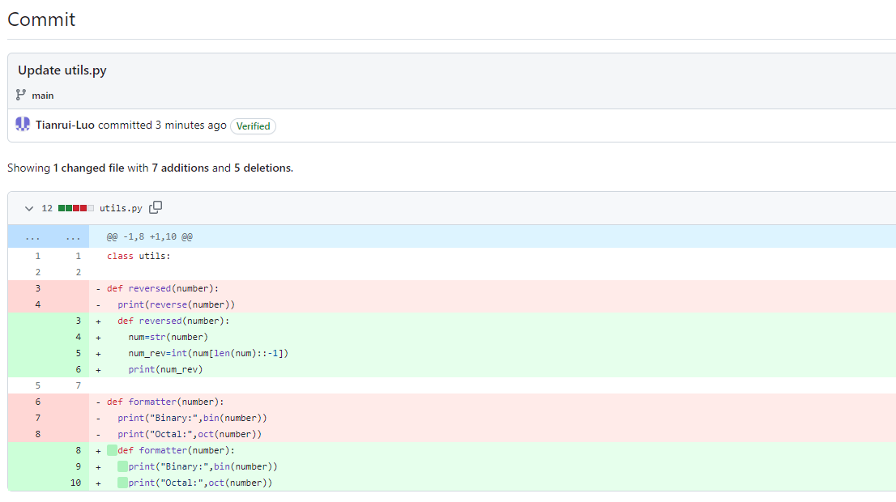
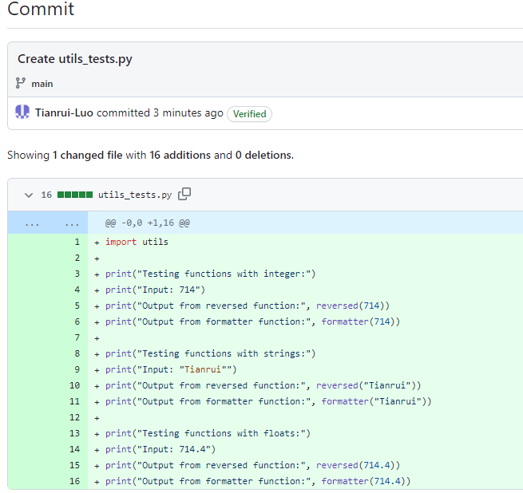

# Tianrui Luo

* Activity 1 Screenshot 

* Activity 2 Screenshot
  Merged helloworld.py from develop to Main

* Activity 3 Screenshot
  Solved the conflict between develope and main branch

* Activity 4 Screenshot
  Commited utils.py and utils_tests.py to the repo

* Activity 5 Screenshot
  Rebased "rebase" branch to "develop" branch
  (I used Github desktop to rebase so no command is used)

